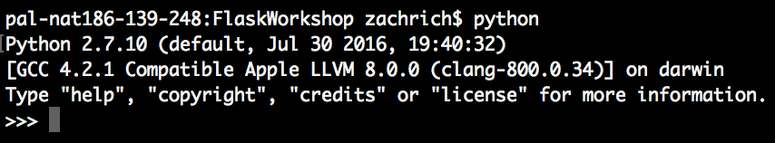

# FLASK Workshop (Create Your Own Web App using FLASK)

Organizers: Abir Shukla, Pranav Vasudha, Zach Rich, and of course Purdue Hackers

Flask is a microframework for Python based on Werkzeug, Jinja 2 and good intentions. It makes it super easy to connect your python (backend) to your HTML (frontend).
Some Projects of FLASK:
  - Moinmoin wiki engine
  - Debian (Operating System) Wiki engine
  - Apache wiki engine

### Installation

This workshop requires some python libraries and pip.
Let's first install python 2.7 and then you can leave the rest up to us.

**Installing Python**
Let's First Check if we already have python.
- For mac/linux open "terminal", type `python` and press ENTER.
If you see python 2.7 then you have python move on to "Installing Everything Else"
- For windows open "Command Prompt", type python and press ENTER.
If you see python 2.7 then you have python move on to "Installing Everything Else"

Expected output (Don't Worry about the .10)


Python 2.7 Install link: https://www.python.org/downloads/release/python-2713/
- Step 1: Find Correct OS Download File (MAC, WINDOWS, etc.)
- Step 2: Download and follow installation steps
- Step 3 (Windows): Add to Path Variable http://stackoverflow.com/questions/7054424/python-not-recognised-as-a-command
- Video tutorial for windows: https://www.youtube.com/watch?v=gD4eulxGNok


**Installing Everything Else**
This workshop requires pip, flask, requests, bs4, and BeautifulSoup.
We have gone ahead and taken care of the download process, just follow these steps:
- Step 1: Download or clone this git repository (For simplicity we ask to put it in your Desktop folder)
- Step 2:
For Windows: Execute the File `installNecessities.bat` (Just Double Click the file)
For Mac/Linux: Execute the File `installNecessities.sh` (Just Double Click the file)
- Step 3: If you do not see anything running do the following
Open up "Terminal" and execute following commands
```sh
$ cd Desktop # or which ever Directory you placed it in
$ cd FlaskWorkshop/Installation/
$ chmod +x ./installNecessities.sh
$ ./installNecessities.sh
```
Now try executing your `installNecessities` file
If problem persists please contact one of the organizers immediately.
- Step 4: while running the "installNecessities" file Observe the following
After the line that prints out "TESTING INSTALLATION ---------------------------"
check if all the installations passed and if you get the "All Good" message,
if you do not see this or see the "TEST FAILED CALL ORGANIZER", contact an organizer.

- Step 5: Install Sublime Text

Download and Follow Steps to install Sublime Text

Download Link: https://www.sublimetext.com/3


[//]: # (These are reference links used in the body of this note and get stripped out when the markdown processor does its job. There is no need to format nicely because it shouldn't be seen. Thanks SO - http://stackoverflow.com/questions/4823468/store-comments-in-markdown-syntax)


   [dill]: <https://github.com/joemccann/dillinger>
   [git-repo-url]: <https://github.com/joemccann/dillinger.git>
   [john gruber]: <http://daringfireball.net>
   [df1]: <http://daringfireball.net/projects/markdown/>
   [markdown-it]: <https://github.com/markdown-it/markdown-it>
   [Ace Editor]: <http://ace.ajax.org>
   [node.js]: <http://nodejs.org>
   [Twitter Bootstrap]: <http://twitter.github.com/bootstrap/>
   [jQuery]: <http://jquery.com>
   [@tjholowaychuk]: <http://twitter.com/tjholowaychuk>
   [express]: <http://expressjs.com>
   [AngularJS]: <http://angularjs.org>
   [Gulp]: <http://gulpjs.com>

   [PlDb]: <https://github.com/joemccann/dillinger/tree/master/plugins/dropbox/README.md>
   [PlGh]: <https://github.com/joemccann/dillinger/tree/master/plugins/github/README.md>
   [PlGd]: <https://github.com/joemccann/dillinger/tree/master/plugins/googledrive/README.md>
   [PlOd]: <https://github.com/joemccann/dillinger/tree/master/plugins/onedrive/README.md>
   [PlMe]: <https://github.com/joemccann/dillinger/tree/master/plugins/medium/README.md>
   [PlGa]: <https://github.com/RahulHP/dillinger/blob/master/plugins/googleanalytics/README.md>
